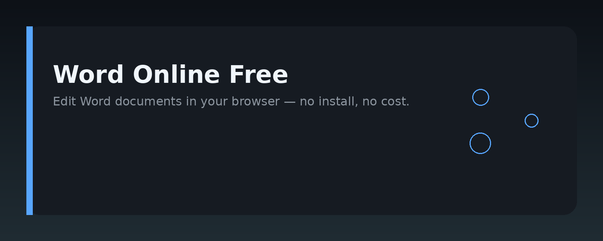
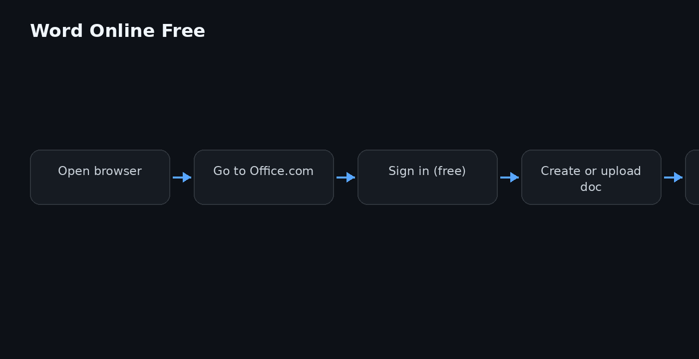

# Word Online Free: Edit Documents in Your Browser




## Overview

This repository is a practical guide for anyone who wants to use Word Online free to edit documents directly in a browser, without installing desktop software. It covers how to access the free tier, what features are available, and how to build a simple workflow around browser-based document editing. The content is aimed at developers and technical writers who need to integrate or automate document editing in a web environment.

## Why it exists

Many teams still assume that editing `.docx` files requires a local installation of a word processor. Word Online free changes that assumption, but the details — what you can do, what you cannot, and how to automate it — are scattered across forums and help pages. This guide consolidates that information into one place.

It exists because:

- Browser-based editing removes the need for per-machine installs.
- The free tier is often enough for lightweight editing, review, and collaboration.
- Developers need clear, non-marketing answers about API limits, file compatibility, and sharing behavior.

## Core concepts

- **Word Online free**: The browser-based version of Microsoft Word, accessible without a paid subscription. You can create, edit, and share documents using a Microsoft account.
- **File compatibility**: Handles `.docx`, `.doc`, `.odt`, `.rtf`, and `.txt` files. Complex formatting may degrade when converting from older formats.
- **Auto-save**: Changes are saved to OneDrive or SharePoint automatically. There is no local save button in the browser interface.
- **Collaboration**: Real-time co-authoring works for multiple users, with visible cursors and version history.
- **Offline limitation**: Requires a network connection. Offline editing is not available in the free browser tier.

## Architecture

The diagram above shows the typical flow. In short:

1. A user opens a document link in a browser.
2. The browser loads the Word Online editor from Microsoft's servers.
3. The editor reads and writes the document file stored in OneDrive or SharePoint.
4. Changes are synced back to the cloud storage, and version history is maintained.
5. If you integrate via the Microsoft Graph API, your app can list, open, and edit documents programmatically.

The key architectural point is that the document never lives on the local machine during editing. All operations happen against the cloud-hosted file.

## Practical workflow

A common workflow for a small team using Word Online free:

1. Create a shared OneDrive folder for the team.
2. Upload existing `.docx` files into that folder.
3. Share the folder link with edit permissions.
4. Each member opens documents in the browser and edits directly.
5. Use comments and track changes for review cycles.
6. Download a copy locally only when a final version is needed.

For developers, the same workflow can be scripted:

- Use the Microsoft Graph API to upload and download files.
- Use the `driveItem` endpoints to check file metadata and version history.
- Trigger a "checkout" by downloading the file, editing locally, and re-uploading.

## Examples

Here is a minimal example of using the Microsoft Graph API to list documents in a shared folder. This assumes you have an access token.

```python
import requests

access_token = "YOUR_ACCESS_TOKEN"
folder_id = "YOUR_FOLDER_ID"

headers = {
    "Authorization": f"Bearer {access_token}",
    "Content-Type": "application/json"
}

url = f"https://graph.microsoft.com/v1.0/me/drive/items/{folder_id}/children"

response = requests.get(url, headers=headers)

if response.status_code == 200:
    items = response.json().get("value", [])
    for item in items:
        if item.get("file"):
            print(item["name"], item["webUrl"])
else:
    print("Error:", response.status_code, response.text)
```

To upload a local file to OneDrive so it can be edited in Word Online free:

```python
import requests

access_token = "YOUR_ACCESS_TOKEN"
folder_id = "YOUR_FOLDER_ID"
file_path = "report.docx"

headers = {
    "Authorization": f"Bearer {access_token}",
    "Content-Type": "application/octet-stream"
}

url = f"https://graph.microsoft.com/v1.0/me/drive/items/{folder_id}:/{file_path.split('/')[-1]}:/content"

with open(file_path, "rb") as f:
    data = f.read()

response = requests.put(url, headers=headers, data=data)

if response.status_code in (200, 201):
    print("Uploaded. Edit at:", response.json()["webUrl"])
else:
    print("Error:", response.status_code, response.text)
```

To check the version history of a document:

```bash
curl -X GET \
  "https://graph.microsoft.com/v1.0/me/drive/items/{ITEM_ID}/versions" \
  -H "Authorization: Bearer YOUR_ACCESS_TOKEN"
```

## FAQ

**Is Word Online free really free?**  
Yes, for personal use with a free Microsoft account. You get basic editing and collaboration. Some advanced features, like mail merge or advanced track changes options, require a paid subscription.

**Can I edit documents offline?**  
No. The browser version requires an active internet connection. For offline editing, you need the desktop app.

**Does it support all Word features?**  
No. Complex macros, some advanced formatting, and certain legacy features are not available or behave differently in the browser.

**Can I use Word Online free for commercial work?**  
Yes, for basic editing. However, the free tier has storage limits on OneDrive, and advanced admin controls are only in paid plans.

**How do I automate editing?**  
You cannot fully automate the UI, but you can automate file operations via the Microsoft Graph API, as shown in the examples above. For content changes, you would download, modify, and re-upload.

**What happens to my formatting when I open a `.doc` file?**  
Word Online converts it to `.docx` internally. Most formatting survives, but some older or obscure features may be lost.

**Is there a mobile version?**  
Yes, the Word mobile app includes free editing, but the browser version works on most mobile browsers too.

## License MIT

Permission is hereby granted, free of charge, to any person obtaining a copy of this software and associated documentation files (the "Software"), to deal in the Software without restriction, including without limitation the rights to use, copy, modify, merge, publish, distribute, sublicense, and/or sell copies of the Software, and to permit persons to whom the Software is furnished to do so, subject to the following conditions:

The above copyright notice and this permission notice shall be included in all copies or substantial portions of the Software.

THE SOFTWARE IS PROVIDED "AS IS", WITHOUT WARRANTY OF ANY KIND, EXPRESS OR IMPLIED, INCLUDING BUT NOT LIMITED TO THE WARRANTIES OF MERCHANTABILITY, FITNESS FOR A PARTICULAR PURPOSE AND NONINFRINGEMENT. IN NO EVENT SHALL THE AUTHORS OR COPYRIGHT HOLDERS BE LIABLE FOR ANY CLAIM, DAMAGES OR OTHER LIABILITY, WHETHER IN AN ACTION OF CONTRACT, TORT OR OTHERWISE, ARISING FROM, OUT OF OR IN CONNECTION WITH THE SOFTWARE OR THE USE OR OTHER DEALINGS IN THE SOFTWARE.

Topic: `word-online-editing`
